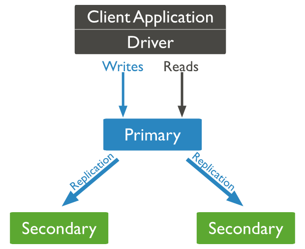
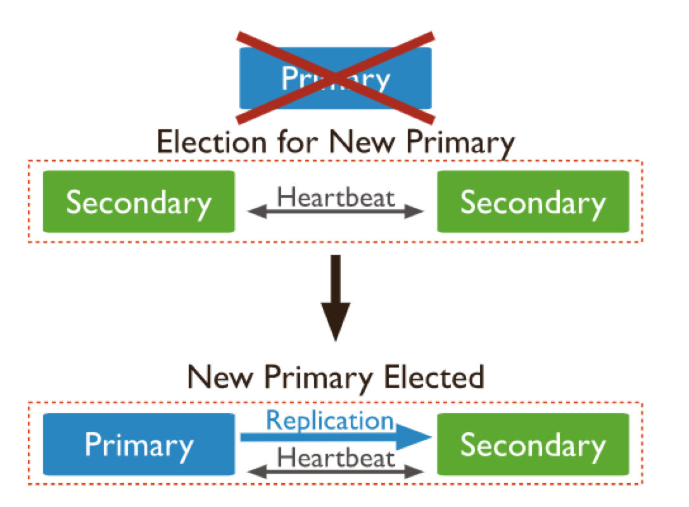
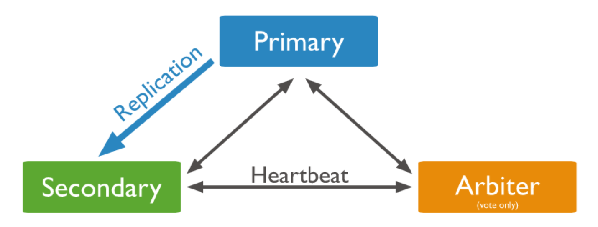
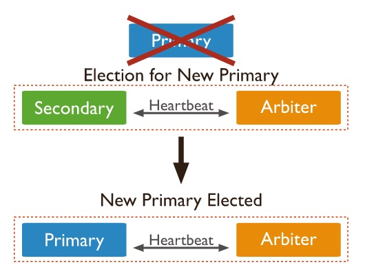
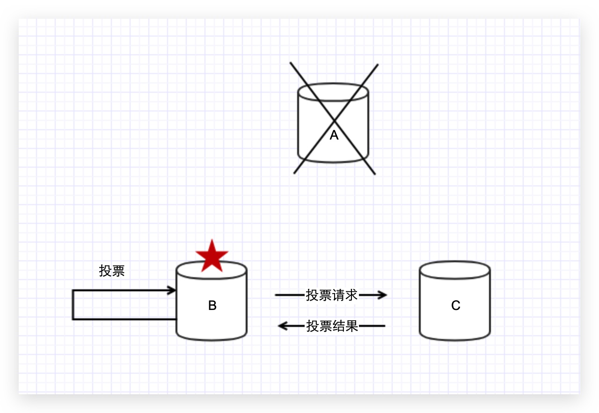

---
nav:
  title: MongoDB
  order: 3
group:
  title: 高阶应用
  order: 3
title: 数据库副本集
order: 3
---

# 数据库副本集

MongoDB 副本集由一组 mongod 实例（进程）组成，包含一个 Primary 节点和多个 Secondary 节点， Mongodb Driver（客户端）的所有数据都写入 Primary，Secondary 从 Primary 同步写入的数据，以保持副本集内所有成员存储相同的数据集，提供数据的高可用。

那么为什么要设置副本集呢？

- 由于副本集是通过不同服务器上保存来的副本，可保证数据在生产部署的冗余和可靠性，不会因为单点问题而丢失数据
- 可以通过访问不同服务器副本数据来提高数据读取能力，从而提高整个系统的负载能力

## 架构原理

副本集包含**多个数据节点**和**可选的一个仲裁节点**。而在数据节点中：只有一个 **主节点（Primary Node）**，其他节点为 **从节点（Secondary Nodes）**。

各个节点成员通过**心跳机制**进行通信，为主节点与节点的通信的时间超过配置的 electionTimeoutMillis 期间（默认 10 秒）时，符合条件的从节点要求选举将自己指定为新主节点，群集尝试完成新主节点的**选举**并恢复正常操作。



**主节点：**副本集只能有一个主节点能够确认写入操作来接收所有写操作，并记录其操作日志中的数据集的所有更改（记录在 oplog 中）。

**应用日志（oplog）：**它保存了修改存储在数据库中的数据的所有操作的 **滚动记录**，MongoDB 在主节点服务器上应用数据库操作，然后在主节点服务器的应用日志上记录操作，然后从节点成员在异步过程中通过心跳机制从任何其他成员导入应用日志并应用这些操作，应用日志中的每个操作都是幂等的。所有副本集成员都在 `local.oplog.rs` 集合中包含 oplog 的副本，这允许它们维护数据库的当前状态。

- 写库日志中的记录可以被重复使用
- 多个线程分批次使用日志记录
- 写库日志的大小和文档大小不一定成正比

**从节点：** 复制主节点的应用日志并将应用日志记录的操作应用于其数据集，如果主节点宕机了，将从符合条件的从节点选举选出新的主节点，。 而且你可以通过配置实现特定的功能，比如：

- 防止从节点成为选举中的主节点 Primary，指定节点优先级。
- 阻止应用程序从节点读取数据，从而允许应用程序运行需要与正常流量分离的应用程序，隐藏节点。
- 保留正在运行的“历史”快照，以用于从某些错误中恢复，例如无意中删除的数据库，延迟节点

**仲裁节点：** 仲裁节点不维护数据集。 仲裁节点的目的是通过响应其他副本集节点的心跳和选举请求来维护副本集中的仲裁。 因为它们不存储数据集，所以仲裁节点可以是提供副本集仲裁功能的好方法，其资源成本比具有数据集的全功能副本集成员更便宜。 如果您的副本集具有偶数个成员，请添加仲裁节点以获得主要选举中的大多数投票。而且仲裁节点总是只有 1 次选举投票，因此允许副本集具有不均匀的投票成员数，而没有复制数据的额外成员的开销。


**心跳机制（Hearbeat）：** 副本集成员间默认**每两秒**会发送一次心跳信息，如果**十秒**未收到某个节点的心跳，则认为该节点已宕机不可以访问；如果宕机的节点为 Primary，Secondary（前提是可被选为 Primary）会发起新的 Primary 选举。仲裁员与其他集合成员之间的唯一沟通是：选举期间的投票，心跳和配置数据，而且这些交换未加密。

**数据同步：** 为了维护共享数据集的最新副本，副本的从节点设置同步或复制来自其他节点的数据。 MongoDB 使用两种形式的数据同步：初始化同步新节点同步完整的数据集，以及整个集群节点同步后续数据更改。

其中，初始化同步（Initial Sync）过程：

- 克隆除本地数据库之外的所有数据库。 要进行克隆，mongod 会扫描每个源数据库中的每个集合，并将所有数据插入到这些集合的自己的副本中。 初始同步会在为每个集合复制文档时构建所有集合索引。 在早期版本的 MongoDB 中，在此阶段仅构建\_id 索引。
- 初始同步在数据复制期间提取新添加的应用日志记录。 确保目标成员在本地数据库中有足够的磁盘空间，以便在此数据复制阶段的持续时间内临时存储这些 oplog 记录。
- 将所有更改应用于数据集。 使用来自源的应用日志，mongod 更新其数据集以反映副本集的当前状态。 初始同步完成后，成员从 STARTUP2 转换为 SECONDARY。

## 标准副本集架构

标准副本集架构由三台服务器，其中包括三个数据节点(一个主节点、两个从节点)或两个数据节点(一个主节点、一个从节点)和一个仲裁节点两种情况。如下所示：

三个数据节点：

- 一个主节点
- 两个从节点，主节点宕机后，有机会选举成为主节点


当主库宕机后，两个从库都会进行竞选，其中一个变为主库，当原主库恢复后，作为从库加入当前的副本集群即可。



两个数据节点以及一个仲裁节点：

- 一个主节点
- 一个从节点，有机会被选举成为主节点
- 一个仲裁节点，只有投票权利



当主节点不可用时，将会选择从节点成为主 Primary，主节点恢复后，将其作为从节点加入到现有的副本集群中即可。



## 节点类型

### 优先级零型节点

优先级 0 型节点不可以成为成为主节点，也不能触发选举。将从节点配置为优先级为 0 以防止它成为主节点，这在多数据中心部署中特别有用，在许多情况下，您无需将备用数据库设置为优先级 0。但是，在具有不同硬件或地理分布的副本集中，优先级为 0 的备用数据库可确保仅某些成员成为主数据库，这样可以根据实际网络分区的网络质量等实际情况进行配置。

例如，一个数据中心承载主数据中心和辅助数据中心：


第二个数据中心节点优先级为 0 只能是从节点数据库，而数据中心（1）中的节点才能成为主节点数据库。（比如你跨机房 A 和 B 部署了一个副本集，并且想指定 Primary 必须在 A 机房，这时可以将 B 机房的副本集成员 Priority 设置为 0，这样 Primary 就一定会是 A 机房的成员）

### 隐藏型节点

隐藏型（Hidden）节点：

- 隐藏型从节点是维护主数据集的副本，但对客户端应用程序不可见。隐藏型从节点适用于具有与副本集中其他成员不同的使用模式
- 隐藏型从节点必须始终优先为 0 型从节点，因此不能成为主节点。隐藏型从节点可能会在选举中投票。
- 隐藏型从节点将不会收到来自应用程序的请求。我们可以将隐藏型从节点专用于报表节点或是备份节点。

### 延迟型节点

由于延迟型从节点是数据集的**滚动备份**或运行**历史**快照，因此它们可以帮助您从各种认为错误中恢复。例如，延迟节点可以从不成功的应用程序升级和操作员错误（包括丢弃的数据库和集合）中恢复。而且延迟型从节点一定是优先级为 0 的从节点，也是隐藏型从节点。不能是主节点，也不能给客户端查询。

在选择延迟量，请考虑延迟量：

- 必须等于或大于预期的维护窗口的持续时间
- 必须小于 oplog 的容量

### 投票型节点和不可投票节点

副本集节点可以通过配置 votes 字段来决定该节点是否具有投票权：

- 0：不可投票节点（持有副本集数据副本，可接受来自客户端应用程序读取操作）
- 1：投票型节点

另外在副本集最多可包含 50 个成员，但只有 7 个投票成员，因此非投票成员允许副本集具有 7 个以上的成员。并投票成员只有具备以下状态可以进行投票：

- PRIMARY
- SECONDARY
- STARTUP2
- RECOVERING
- ARBITER
- ROLLBACK

**配置：**

```json
{
  "_id": <num>,
  "host": <hostname:port>,
  "arbiterOnly": false,
  "buildIndexes": true,
  "hidden": false,
  "priority": 0,
  "tags": {},
	"slaveDelay": NumberLong(0),
	"votes": 0
}
```

## 副本集选举

如果副本集中的主节点出现故障，那么主节点无法继续处理客户发出的请求。在 MongoDB 副本集中只有主节点可以处理客户发出的 **写** 请求，一旦主节点发生故障，客户难道无法继续往副本集中写任何数据吗？这种情况显然是无法满足高可用性的要求的。

副本集当中的主节点并非一成不变，同时也非使用者指定的而一直不会变化的，副本集当中的主节点其实是由整个副本集通过选举算法推选出来的。那么当原本的主节点无法继续工作的时候，会通过一次新的选举来从副本集当中其他的节点重选出新的主节点，如此便能恢复副本集的正常运作，主节点也能继续处理客户的写操作。

下面通过示例图描述副本集选举的过程：



在讲解副本集选举过程前，需要提及的是：副本集当中每个节点都会有所谓的选举计数器，英文称为 `term`。计数器在每次在节点参与新的选举时候，都会将自身的选举计数器自增一，默认为 `N`，表示所有节点到目前为止都参与了 `N` 次选举。

假设主节点 A 出现故障（崩溃、下线），其余两个副节点均可发起副本集选举。由于主节点 A 本应不停地为其余副节点发送心跳请求，当主节点 A 出现故障，那么很可能本应该发送的心跳请求超时，使得其他副节点发现主节点不再发送心跳请求，很可能原有的主节点不再工作。在这种情况下，任意副节点都可以发起一场新的选举，当然在实际情况当中，我们可以为不同的节点设置不同的优先级别，当各个节点的优先级别不同时，MongoDB 的算法会尽最大的努力，让优先级别高的副节点成为最先发起选举的节点，也就是说优先级别高的副节点有更大的可能性成为新的主节点。

假设副节点 B 发起选举，那么就称副节点 B 为候选主节点，他发起这场选举的目的，是为了讯问其余副节点，看大家是否同意选举节点成为新的主节点。

首先候选主节点会给自身的选举计数器 `+1`，因为他要发起的是一场新的选举，他会为自己投票，这是完全允许的

然后会为其他节点发送投票请求，也就是询问其他节点是否愿意为该候选主节点投票

候选节点会把自身计数器的值也发送给投票节点 C，投票节点 C 收到投票请求后，发现候选节点计数器的值比投票节点计数器的值更大，会先把自身的计数器的值更新，与发起投票的候选节点的值同步值的大小，再决定投票结果发回给候选节点

投票结果或是同意，或是反对。投票节点通常通过候选节点和投票节点的同步性作为比较， 也就是比较与原本主节点的数据相似程度。当候选节点比投票节点分别与原本主节点比较的数据同步更高，那么投票节点就会为候选节点投出同意票。反之，则会投出反对票。

候选节点会把投票请求发送给副本集中的所有节点，当然包括失联的主节点。原本的主节点可能存在不正常的状态，他未必能响应成功的结果，那么会视该节点投了反对票

当候选节点收集了副本集中其他节点的投票结果之后，如果超过半数的其他节点（包括该候选节点本身所投的票）给该候选节点投了赞成票，那么该候选节点会当选成新的主节点。这时候该副本集将会恢复正常的运作，可以继续处理客户发来的读写操作

### 选举要点

- 候选节点发起选举，每个节点投票给比自己更同步的节点
- 得到超过半数选票的候选节点会当选为主节点
- 副本集中最多可以有 7 个投票节点

### 触发选举的事件

触发选举的事件是有多种的：

- 主节点与副节点之间的心跳请求超时
- 副本集初始化：初始化时还没有主节点和副节点
- 新节点加入副本集：这里说的新节点未必是全新的节点，也可能是原来失联的节点重新连接回副本集当中

## 集群模式

当应用数据量大或并发量上来后，单机模式肯定无法抗住压力，这个时候就需要考虑使用集群进行部署。MongoDB 目前为止支持三种集群模式：主从集群、副本集集群和分片集群。

## 部署

### 最大投票成员为数量

副本集最多可包含 50 个成员，但只有 7 个投票成员。如果副本集已有 7 个投票成员，则其他成员必须是非投票成员。

### 部署奇数个成员

副本集应该确保具有奇数个投票成员，如果您拥有偶数个投票成员，请部署仲裁节点，以便该集合具有奇数个投票成员。仲裁节点不存储数据的副本并且需要更少的资源。因此，您可以在应用程序服务器或其他共享进程上运行仲裁程序。

**容错能力**

副本集的容错是当变为不可用的成员数，并且仍然在副本集中留下足够的节点成员来选择主节点成员。容错是副本集大小的影响， 见下表：

| 选举成员数量 | 选举所需多数票 | 容错 |
| ------------ | -------------- | ---- |
| 3            | 2              | 1    |
| 4            | 3              | 1    |
| 5            | 3              | 2    |
| 6            | 4              | 2    |

因此可以得出，将成员添加为偶数个到副本集并不总是会增加容错能力。但是，在这些情况下，其中将其中一个节点设置成隐藏型和延迟型从节点可以为专用功能提供支持，例如备份或报告。

**提高读负载能力**

在具有非常高读取流量的部署中，您可以通过将读取分发给从节点来提高读取吞吐量。随着部署的增长，将节点添加或移动到备用数据中心以提高冗余和可用性。

**副本集分布在两个或更多数据中心**

副本集分布在两个或更多数据中心的优势：

- 如果其中一个数据中心发生故障，数据仍可用于读取
- 如果具有少数成员的数据中心发生故障，则副本集仍可以提供写操作以及读操作。但是，如果具有大多数成员的数据中心发生故障，则副本集将变为只读。

**在不同地域部署数据节点（具有备用的数据中心）**

要在数据中心发生故障时，请在备用数据中心至少保留一个成员。 如果可能，使用奇数个数据中心，并选择一个成员分布，以最大限度地提高即使丢失数据中心的可能性，剩余的副本集成员可以形成可以形成“大多数”选取出主节点，并有提供数据的副本的能力。为确保主数据中心的节点在备用数据中心的成员之前被选为主要成员，请将备用数据中心中节点`members[n].priority` 设置为低于主数据中节点，如下所示：

**根据部署结构部署副本集示例** **三个节点成员的副本集，成员合理分布以及解析如下**：

- 两个数据中心：数据中心 1 的两个成员和数据中心 2 的一个成员。如果副本集的其中一个成员是仲裁者，则将仲裁者分配给具有数据承载成员的数据中心 1。
- 如果数据中心 1 关闭，则副本集将变为只读。
- 如果数据中心 2 关闭，则副本集仍然可写，因为数据中心 1 中的成员可以进行选举。
- 三个数据中心：一个成员到数据中心 1，一个成员到数据中心 2，一个成员到数据中心 3。
- 如果任何数据中心发生故障，副本集仍然可写，因为其余成员可以举行选举。

**五副节点成员的副本集，成员合理分布以及解析如下：**

- 两个数据中心：数据中心 1 的三个成员和数据中心 2 的两个成员。
- 如果数据中心 1 关闭，则副本集将变为只读。
- 如果数据中心 2 关闭，则副本集仍然可写，因为数据中心 1 中的成员可以创建多数。
- 三个数据中心：数据中心 1 的两个成员，数据中心 2 的两个成员和数据中心 3 的一个成员。
- 如果任何数据中心发生故障，副本集仍然可写，因为其余成员可以举行选举。

**高可用**
集群具有自主选举能力，影响选取的因子和条件有以下：

- 选取协议
- 心跳机制：副本集成员间默认每 2s 会发送一次心跳信息，如果 10s 未收到某个节点的心跳，则认为该节点已宕机不可以访问；如果宕机的节点为 Primary，Secondary（前提是可被选为 Primary）会发起新的 Primary 选举。
- 节点优先权：每个节点都会倾向于投票给优先级最高的节点，优先级为 0 的节点不能成为主节点 Primary，也不会主动发起 Primary 选举。当 Primary 发现有优先级更高 Secondary，并且该 Secondary 的数据落后在 10s 内，则 Primary 会主动降级，让优先级更高的 Secondary 有成为 Primary 的机会。
- 丢失数据中心：使用分布式副本集，数据中心的丢失可能会影响其他数据中心或数据中心中其余成员选择主数据库的能力。如果可能，在数据中心之间分发副本集成员，以最大限度地提高即使丢失数据中心的可能性，其余一个副本集成员也可以成为新的主要成员。
- 网络分区：只有跟大多数投票节点间能保持网络畅通，才有机会被选主节点 Primary；如果 Primary 与大多数的节点失去联系，Primary 会主动降级为 Secondary。当发生网络分区时，可能在短时间内出现多个 Primary，故 Driver 在写入时，最好设置『大多数成功』的策略，这样即使出现多个 Primary，也只有一个 Primary 能成功写入大多数。

---

**参考资料：**

- [📝 认识 MongoDB 副本集](https://juejin.im/post/5cdba4a551882538841bca8c)
- [📝 MongoDB 系列：解决面试中可能遇到的 MongoDB 副本集问题](https://juejin.im/post/5d492ab9f265da03ad1437ed)
- [📝 MongoDB 主从复制/副本集/分片集群介绍](https://www.cnblogs.com/kevingrace/p/5685486.html)
- [📝 MongoDB 集群运维笔记](https://www.cnblogs.com/kevingrace/p/8178549.html)
- [📝 MongoDB 之集群模式](https://www.cnblogs.com/wadeyu/p/7930608.html)
